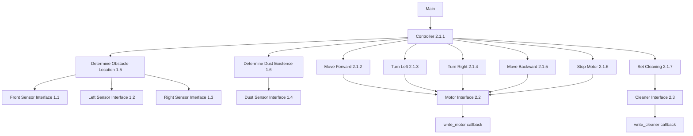

# 01. 구조와 파일의 대응

갱신: 2026-10-03. 실제 함수 계약은 [05](05_function_specifications.md), 상태별 명령은 [06](06_implemented_design.md), 검증 상태는 실행 기록에서 확인한다.

## 구조를 읽는 방법

DFD는 데이터 변환 관계, Structured Chart는 모듈 호출 관계, FSM은 Controller의 상태별 판단 규칙이다. 논리적인 상위 프로세스마다 전달 전용 함수나 파일을 하나씩 만들 필요는 없지만, 책임과 경계의 입력·출력을 생략해서는 안 된다.

현재 구현 계약은 사용자가 제시한 `Main → Controller` 호출 구조에 맞춘다. 공개 `rvc_tick`은 Controller에 위임하는 진입점이며, 입력 처리 정책을 별도로 결정하는 상위 제어기가 아니다. 이전 초안의 별도 `detection.c` 조정 계층은 제거한다.

이 그림의 선은 호출 관계다. 이동과 청소는 한 전이에서 함께 호출될 수 있다. 이를 배타적인 두 가지 선택으로 표현하면 안 된다. Front는 초기 읽기 후 변경 보고 캐시를 사용하고, Left/Right/Dust는 Tick마다 읽는다. 초기화와 비동기 전방 보고의 별도 경로는 06의 이벤트 계약에 명시한다.

## 파일 대응표

| DFD 번호 | 논리적 책임 | 구현 파일 |
|---|---|---|
| 외부 실행 | Main: 장치 연결, 이벤트 전달, 종료 | app/main.c |
| 0의 API | 객체 생성·수명주기와 공개 진입점 | src/rvc.c |
| 1 | 센서 입력을 장애물·먼지 정보로 변환 | 아래 sensing/perception 모듈들의 논리적 묶음 |
| 1.1 | Front Sensor Interface | src/sensing/front_sensor.c |
| 1.2 | Left Sensor Interface | src/sensing/left_sensor.c |
| 1.3 | Right Sensor Interface | src/sensing/right_sensor.c |
| 1.4 | Dust Sensor Interface | src/sensing/dust_sensor.c |
| 1.5 | Determine Obstacle Location | src/perception/obstacle_detector.c |
| 1.6 | Determine Dust Existence | src/perception/dust_detector.c |
| 2 / 2.1 | 전체 출력 제어 / 이동·청소 결정 | Controller와 actions의 논리적 묶음 |
| 2.1.1 | Controller 및 그 상세 FSM | src/control/controller.c |
| 2.1.2 | Move Forward | src/actions/move_forward.c |
| 2.1.3 | Turn Left | src/actions/turn_left.c |
| 2.1.4 | Turn Right | src/actions/turn_right.c |
| 2.1.5 | Move Backward | src/actions/move_backward.c |
| 2.1.6 | Stop Motor | src/actions/stop_motor.c |
| 2.1.7 | Set Cleaning | src/actions/set_cleaning.c |
| 2.2 | Motor Interface | src/interfaces/motor_interface.c |
| 2.3 | Cleaner Interface | src/interfaces/cleaner_interface.c |

후진은 강의 234p에도 있는 기능이다. 이전 초안의 “후진은 새 확장 기능”이라는 표기는 잘못됐으므로 삭제했다. Stop Motor와 Set Cleaning을 명시적으로 분리한 세부 번호는 현재 팀 설계의 번호와 함께 관리한다.

## C 모듈화 방식

제품은 C17이며 C++ class를 사용하지 않는다. 공개 `Rvc*`는 내부 구조를 감춘 불완전 타입이다. 내부 정의는 `src/internal/rvc_internal.h`에 있으며 FSM·센서·장치 상태는 로봇 인스턴스별로 보관한다. 각 모듈의 구현은 `.c`, 다른 모듈에 공개하는 선언은 `.h`로 분리한다. 소스는 필요한 헤더를 include하고 빌드가 각 `.c`를 컴파일·링크한다. `.c` 파일을 다른 `.c`에서 include하지 않는다.

여러 동작 모듈은 `actions.h`를 공유한다. 논리 모듈 하나에 헤더 하나를 기계적으로 만드는 대신, 외부에서 사용할 계약을 관련 헤더에 모은다. GoogleTest를 쓰는 C++ 테스트 실행기에서도 C 제품을 호출할 수 있도록 외부 함수 선언은 C linkage를 제공한다.

## 상태 소유권

| 주체 | 소유·갱신 책임 |
|---|---|
| Main/테스트 실행기 | 논리 Tick 발생, 전방 이벤트 전달, 생성·초기화·shutdown·해제 순서 |
| Sensor Interface | 읽은 센서 캐시와 유효 여부 |
| Determine 모듈 | 센서 인터페이스 호출, 결과가 모두 유효한지 확인, 결과 반환 |
| Controller | FSM 현재 상태, 회전·후진 경과 Tick, 고정 입력 스냅샷, 명령 순서 |
| 동작 모듈 | 의미 있는 동작을 인터페이스 명령으로 변환, 전진 Enable/Disable |
| Motor/Cleaner Interface | 콜백 호출, 성공 출력과 출력 유효성 |
| 호출자 소유 장치 context | 모의/실제 센서값과 물리 장치·출력 로그 |

회전·후진 모듈에는 sleep이나 자체 카운터가 없다. 추가 먼지 유지 타이머도 없다. 공개 Tick, 전방 보고, 초기화, 종료는 한 실행 흐름에서 직렬 호출한다. 실제 ISR과의 동시 접근은 이 구현 계약의 범위가 아니며, 실제 장치 어댑터에서는 이벤트를 직렬 전달하도록 연결해야 한다.
