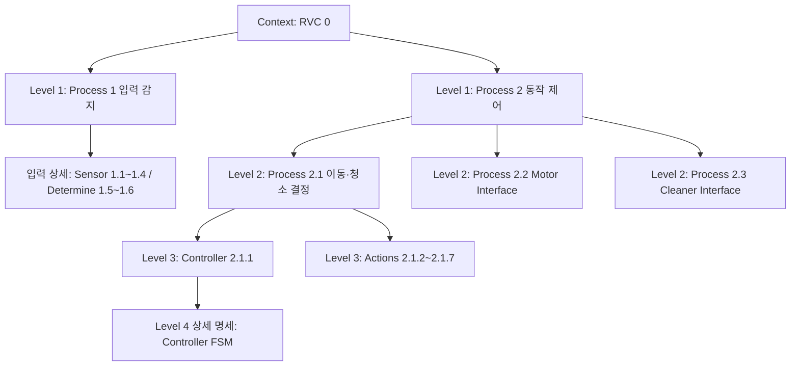

# 06. 현재 구현 설계와 교수 피드백의 연결

기준일: 2026-10-03. 본 문서는 현재 작업용 C 구현의 계약을 명시한다. 이 문서 작성 자체는 테스트 성공의 증거가 아니며 실제 빌드·테스트 결과는 실행 기록을 확인한다. 원본 과제·원격 공유 PPT·제출용은 이 작업에서 변경하지 않는다.

## 1. 근거와 기존 초안에서 바뀐 점

- PDF 255p: 완전한 Structured Charts, DFD에 근거한 C 구현, 장치 라이브러리 에뮬레이션 허용.
- 공유 PPT: 6개 상태, STOP_OFF, 오른쪽 우선, 회전 5 Tick·후진 3 Tick. 먼지 미감지 시 일반 청소 복귀.
- 교수 피드백: FSM의 Command, 누락된 DFD 상위 계층, 초기화와 출력 인터페이스 연결, Controller 2.1.1의 상세화.
- 코드 조정: 별도 입력 조정 계층을 제거하고 원래 구조도인 Controller → Determine → Sensor로 맞춘다.
- 모순 해소: 회전·후진의 시간 관리는 Controller로 통일한다. 이전 초안의 먼지 5 Tick 추가 유지와 해당 telemetry 필드는 제거한다.

회전/후진 수치와 우측 우선은 팀 정책이며 강의가 고정한 유일한 답이 아니다. 특히 강의 “for a while”와 감지 중에만 강화하는 현재 PPT의 해석은 추가 피드백 가능성이 남는다. 기존 PPT를 유지해 구현하며 채점 통과를 보증하지 않는다.

## 2. DFD 분해 관계

아래는 **DFD 계층을 요약한 분해도**다. 각 상자의 연결선은 분해 관계이며 실제 데이터 흐름 화살표가 아니다. Level 번호는 현재 팀 자료의 용어를 따른다.



경계의 데이터/제어 흐름은 다음과 같다.

| 경계 | 입력 | 출력 |
|---|---|---|
| Context RVC | 전방 보고, 좌·우·먼지 센서값, Tick | Motor Direction, Cleaner Command |
| Process 1 | 센서값 | 장애물 `{F,L,R}`, 먼지 `D` |
| Process 2 | `{F,L,R}`, `D`, Tick | 장치에 전달할 이동·청소 명령 |
| Process 2.1 | 입력 스냅샷, Tick, 이전 상태/시간 | Actions를 통한 Motor/Cleaner 명령 |
| Process 2.2 | STOP/FORWARD/LEFT/RIGHT/BACKWARD | Motor 장치 콜백 |
| Process 2.3 | OFF/ON/UP | Cleaner 장치 콜백 |
| Controller 2.1.1 | Determine 반환값, Tick, 상태/시간 | Enable/Disable, Trigger, OFF/ON/POWER1 |

Level 4의 FSM은 2.1.1을 상세화한다. 2.2·2.3의 출력이 FSM initial node로 되돌아가는 것으로 그리지 않는다. 초기 상태를 만드는 **Controller의 명령이 Actions → 2.2/2.3 → 실제 장치**로 전달되는 경로를 표시한다.

## 3. 실제 모듈 호출과 C 표현

[01 구조도](01_structure.md)의 Controller가 센서 판단과 동작을 직접 호출한다. `rvc_tick`은 Controller의 공개 진입점이다. Main은 센서 판단이나 회피 정책을 복제하지 않는다. 센서 콜백과 출력 콜백은 모의/실제 라이브러리 교체 지점이다.

- Determine 함수: `Rvc*`로 장치에 접근, `out` 포인터로 감지 결과 반환, return으로 성공/실패 전달.
- Move Forward: Enable/Disable enum을 매개변수로 전달.
- Turn/Backward/Stop: 호출 자체를 Trigger로 대응.
- Set Cleaning: OFF/ON/POWER1 enum을 매개변수로 전달.
- Controller return: `RvcStatus`. CommandList를 반환하는 구조가 아니다.
- 센서와 출력 인터페이스는 추가 하위 장치 콜백을 호출한다.

제품 C17, 테스트 실행기 C++17/GoogleTest를 사용할 수 있다. 공개 객체를 쓰는 테스트는 상태를 강제로 넣지 않고 초기화와 이벤트 이력으로 목표 상태에 도달한다.

## 4. 상태·입력·시간의 의미

| 값 | 의미 |
|---|---|
| F/L/R | 해당 방향에 장애물이 있으면 true |
| D | 먼지가 감지되면 true |
| STOP_OFF | 모터 STOP, 청소 OFF, 초기 업무 상태 |
| F_ON | 모터 FORWARD, 청소 ON |
| F_POWER1 | 모터 FORWARD, 청소 UP |
| LEFT_OFF / RIGHT_OFF | 해당 방향 회전, 청소 OFF |
| BACK_OFF | 후진, 청소 OFF |
| elapsed_ticks | 현재 회피 구간 진입 후 경과한 논리 Tick 수 |

`UNINITIALIZED`는 API의 준비 상태다. 동작 FSM의 일곱 번째 청소 상태가 아니다. init/fault/shutdown 후 준비 여부를 제어하며, 초기화 성공 전에는 일반 Tick을 실행하지 않는다.

초기 센서는 네 값을 준비한다. 이후 Front는 `report_front`로 캐시를 갱신하고, Left/Right/Dust는 매 Tick 읽는다. 각 Tick에서 하나의 고정 스냅샷으로 한 번 판단한다. 읽기에 실패한 일부 새 캐시를 완료된 입력 스냅샷처럼 공개하지 않는다.

회피 진입 Tick은 `e=0`. 회전은 후속 5번째 Tick, 후진은 후속 3번째 Tick에서 완료를 판단한다. `e<T`인 동안 입력은 갱신하지만 일반 입력에 따른 방향 전환은 하지 않는다. 장치 오류 경로는 별도로 처리한다.

```text
Tick 20: 회전 진입 e=0, Right 출력
Tick 21: e=1, 출력 유지
Tick 22: e=2, 출력 유지
Tick 23: e=3, 출력 유지
Tick 24: e=4, 출력 유지
Tick 25: e=5, 최신 입력으로 다음 동작 선택
```

실제 시간 대기는 Main의 선택이다. CSV 한 행을 한 Tick으로 실행할 수 있고 `--realtime-ms 200` 실행 방식은 Tick 사이 대기 예시다. Controller 안에는 sleep이 없다. Tick 5회를 테스트할 때 실제 1초를 기다릴 필요가 없다.

## 5. 전이와 Command

아래 표는 다음 두 결정을 사용한다.

- `일반 선택`: F=false이면 D에 따라 F_ON/F_POWER1. F=true이면 R=false 우회전, 아니면 L=false 좌회전, 모두 막혔으면 후진.
- `후진 완료 선택`: F와 무관하게 R=false 우회전, 아니면 L=false 좌회전, 둘 다 막히면 재후진. 후진에서 직접 전진하지 않는다.

명령 묶음의 의미는 다음과 같다. 출력이 이미 유효한 값이면 중복 명령을 줄인다.

| 기호 | 실제 동작 호출 및 순서 |
|---|---|
| `전진(ON/UP)` | 이전 상태가 전진이 아니거나 모터 출력이 유효하지 않으면 Move Forward(ENABLE). 청소 출력이 유효하지 않거나 목표와 다르면 Set Cleaning(ON/POWER1). 따라서 둘 다 필요하면 Forward → ON/UP |
| `회피(Left/Right/Back)` | 이전 상태가 전진이면 Move Forward(DISABLE). 청소가 이미 유효한 OFF가 아니면 Set Cleaning(OFF). 그 뒤 선택한 회피 함수를 반드시 Trigger |
| `유지` | 명령 없음. 이전의 성공 출력 유지 |
| `초기화` | Stop Motor → Set Cleaning(OFF), 둘 모두 시도. 센서 준비 성공 후 STOP_OFF |
| `오류/종료` | Set Cleaning(OFF) → Stop Motor, 둘 모두 시도. 성공 여부와 무관하게 미준비 전환 |

회피 시 이미 OFF라면 OFF를 다시 쓰지 않는다. 따라서 STOP_OFF에서 회피를 시작하거나 회피 구간 경계에서 다음 회피를 시작할 때 출력 로그에는 모터 Trigger만 있을 수 있다. 전진에서 회피로 갈 때는 OFF가 회피 모터 명령보다 먼저 기록된다. Disable은 내부 활성 해제이며 모터 STOP 명령이 아니다.

| 전이 ID | 현재 상태 | 조건 | 다음 상태 | Command / 시간 처리 |
|---|---|---|---|---|
| INIT | 미준비 | 초기화 성공 | STOP_OFF | 초기화, e=0 |
| S1 | STOP_OFF | F=false, D=false | F_ON | 전진(ON) |
| S2 | STOP_OFF | F=false, D=true | F_POWER1 | 전진(UP) |
| S3 | STOP_OFF | F=true, R=false | RIGHT_OFF | 회피(Right), e=0 |
| S4 | STOP_OFF | F=true, R=true, L=false | LEFT_OFF | 회피(Left), e=0 |
| S5 | STOP_OFF | F=L=R=true | BACK_OFF | 회피(Back), e=0 |
| F1 | F_ON/F_POWER1 | F=false | D에 맞는 전진 상태 | 청소 모드가 변하면 ON/UP, 그 외 유지. 모터 재명령 없음 |
| F2 | F_ON/F_POWER1 | F=true, R=false | RIGHT_OFF | 회피(Right), e=0 |
| F3 | F_ON/F_POWER1 | F=true, R=true, L=false | LEFT_OFF | 회피(Left), e=0 |
| F4 | F_ON/F_POWER1 | F=L=R=true | BACK_OFF | 회피(Back), e=0 |
| T1 | LEFT_OFF/RIGHT_OFF | 증가한 e<5 | 현재 상태 | 유지 |
| T2 | LEFT_OFF/RIGHT_OFF | 증가한 e=5 | 일반 선택 결과 | 전진 또는 회피 명령. 새 회피 구간이면 e=0 |
| B1 | BACK_OFF | 증가한 e<3 | BACK_OFF | 유지 |
| B2 | BACK_OFF | 증가한 e=3, R=false | RIGHT_OFF | 회피(Right), e=0 |
| B3 | BACK_OFF | 증가한 e=3, R=true, L=false | LEFT_OFF | 회피(Left), e=0 |
| B4 | BACK_OFF | 증가한 e=3, L=R=true | BACK_OFF | 회피(Back) 재Trigger, e=0 |
| ERR | 준비된 임의 상태 | 센서/명령 I/O 실패 | 미준비 | 오류 처리. 장치 출력은 최선의 시도이며 성공 보장 아님 |
| END | 생성된 객체 | shutdown | 미준비 | 종료 처리 |

표의 전이 ID는 문서의 추적용 ID다. 코드에 동일한 문자열 enum이 존재한다는 의미는 아니다. 두 회전 방향의 T2는 일반 선택으로 정확히 분해할 수 있으며 새로운 상태 규칙이 아니다.

먼지 타이머는 없다. D=true가 유지되면 UP 상태를 유지한다. D=false가 된 첫 전진 판단에서 ON으로 복귀한다. 회피 중에는 D에 관계없이 OFF이며, 회피 종료 후 전진한다면 그 Tick의 D를 사용한다.

## 6. 초기화·오류·종료의 관찰 가능성

성공한 초기화는 Stop과 Off를 장치 인터페이스를 거쳐 보낸 뒤 유효 센서를 얻고 STOP_OFF를 확정한다. 초기 명령 중 한 번이 실패해도 다른 초기 명령을 시도한다. 준비가 끝나지 않은 객체의 Tick은 NOT_READY다.

Tick 중 장치 오류에는 OFF와 STOP을 모두 시도한다. 예를 들어 OFF 자체가 실패할 수 있으므로 “오류면 무조건 장치가 안전해진다”고 말할 수 없다. 실패한 출력의 유효성을 해제하고 실행을 잠그며 재초기화를 요구한다. 이전에 성공한 장치 명령을 원자적으로 되돌린 것으로 취급하지 않는다.

`get_telemetry`는 준비 완료된 객체의 복사본만 반환한다. fault/shutdown 후에는 NOT_READY이고 out을 변경하지 않는다. 이때 테스트는 반환 상태, 성공 출력 로그, 실패 시도까지 포함한 장치 호출 횟수를 본다. `destroy`는 메모리만 해제하며 장치 정지는 `shutdown`에서 수행한다.

## 7. 교수 피드백의 해결 위치와 테스트 연결

| 피드백/요구 | 문서·코드의 대응 | 필요한 검사 |
|---|---|---|
| FSM에 Command 없음 | 이 문서 5절, Controller의 실제 동작 호출 | 각 전이의 출력 값·순서·명령 없음 |
| DFD 상위 계층 누락 | 2절의 Process1/2, 2.1/2.2/2.3와 경계 표 | 상위/하위 입력·출력 보존 대조 |
| initial과 출력 연결 불명확 | INIT → Stop/Off → 2.2/2.3 → 장치 | 초기화 로그 STOP, OFF |
| FSM이 2.1.1 상세여야 함 | Controller 단일 FSM과 단일 타이머 소유 | 우선순위와 시간 경계 테스트 |
| 동작 아래 인터페이스 필요 | 01 구조도와 actions/interfaces 호출 | Trigger에서 실제 콜백까지 전달 |
| 센서·회피·먼지 조합 | 일반 선택과 후진 완료 선택 | Boolean 16조합, 회전/후진 경계, 먼지 모드 변경 |
| 테스트 가능한 C 모듈화 | opaque Rvc와 인스턴스별 장치 콜백 | 복수 인스턴스, 입력 이력, 실패·재초기화 |

현재 구현용 보완 문서는 원격 PPT 편집 결과가 아니다. 팀의 최종 설계 자료에는 11p 계층도, FSM 명령 표기, 타이머 책임, 함수 입출력 및 초기화 출력 경로를 같은 계약으로 옮겨야 한다. 제출용 정리와 채점 항목 확정은 별도 작업이다.
